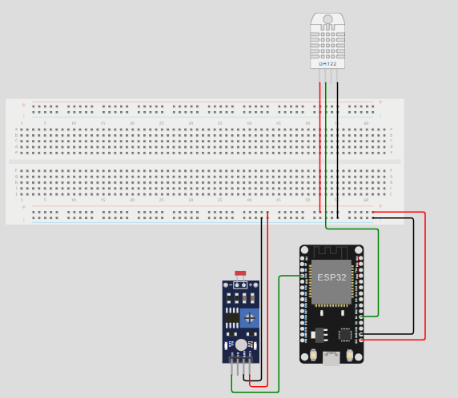

# 🌟 Sistema de Monitoramento de Sensores com MQTT 🌟

## 📜 Descrição

Este projeto implementa um sistema de monitoramento de sensores utilizando um **ESP32** para coletar dados de **luminosidade**, **temperatura** e **umidade**, e um aplicativo **Dash** para visualizar esses dados em tempo real. A comunicação entre o ESP32 e o aplicativo Dash é feita através do protocolo **MQTT**.

---

## 🛠️ Componentes do Sistema

### 1. Código do ESP32

O código do ESP32 é responsável por:

- 🌐 Conectar-se a uma rede Wi-Fi.
- 📊 Publicar dados dos sensores (luminosidade, temperatura e umidade) em tópicos específicos do broker MQTT.
- 💡 Receber comandos via MQTT para ligar ou desligar um LED onboard.

#### Principais Funcionalidades:
- **Coleta de Dados:** Utiliza um sensor **DHT22** para ler temperatura e umidade, e um sensor analógico para ler luminosidade.
- **Publicação no MQTT:** Envia dados de luminosidade, temperatura e umidade para o broker MQTT.
- **Controle do LED:** Permite ligar ou desligar um LED onboard baseado em mensagens recebidas via MQTT.

---

### 2. Código do Dash

O aplicativo Dash exibe os dados coletados pelo ESP32 em gráficos interativos.

#### Principais Funcionalidades:
- 📈 **Visualização de Dados:** Gráficos combinados para mostrar luminosidade, temperatura e umidade ao longo do tempo.
- 🔄 **Atualização em Tempo Real:** Atualiza automaticamente os gráficos a cada 10 segundos para refletir os dados mais recentes.

---

## 🏗️ Arquitetura do Sistema

1. **ESP32:** Coleta os dados dos sensores e publica as informações no broker MQTT.
2. **Broker MQTT:** Atua como intermediário para a comunicação entre o ESP32 e o aplicativo Dash.
3. **Dash App:** Se conecta ao broker MQTT para receber e visualizar os dados em tempo real.

---

## 🚀 Como Executar o Projeto

### Pré-requisitos

- 🔧 Um módulo **ESP32**.
- 🌡️ Um sensor **DHT22** para medir temperatura e umidade.
- 🌞 Um sensor de luminosidade (LDR).
- 🌐 Acesso a uma rede Wi-Fi.
- 📚 Instalação das bibliotecas necessárias (ex.: `WiFi`, `PubSubClient`, `DHT`, `Dash` e `Plotly`).

### Configuração

1. **Configurar o ESP32:**
   - 🔑 Ajuste as credenciais da rede Wi-Fi e as configurações do broker MQTT no código do ESP32.
   - 📤 Carregue o código no seu ESP32.

2. **Executar o Aplicativo Dash:**
   - 🔍 Instale as dependências necessárias usando:
     ```bash
     pip install dash plotly paho-mqtt
     ```
   - ▶️ Execute o aplicativo Dash com:
     ```bash
     python seu_codigo_dash.py
     ```

3. **Acessar o Dash App:**
   - 🌐 Abra um navegador e vá para [http://127.0.0.1:8050](http://127.0.0.1:8050) para visualizar os dados dos sensores.

---

# 🌐 Acesse o Projeto no Wokwi

Explore o projeto interativo diretamente no Wokwi:

[](https://wokwi.com/projects/409782957418769409)

[**🌟 Acesse o Projeto no Wokwi**](https://wokwi.com/projects/409782957418769409)

---

## 👩‍💻 Desenvolvedores

| Desenvolvedor | Avatar | RM |
| ------------- | ------ | -- |
|  | <a href="https://github.com/CezarBacanieski"></a> | RM555206 |
|  | <a href="https://github.com/LorenzoMangini"></a> | RM554901 |
|  | <a href="https://github.com/luyz-gusta"></a> | RM558358 |
|  | <a href="https://github.com/vitorbmulford"></a> | RM555026 |

---

### 🎉 Obrigado por conferir nosso projeto! 
